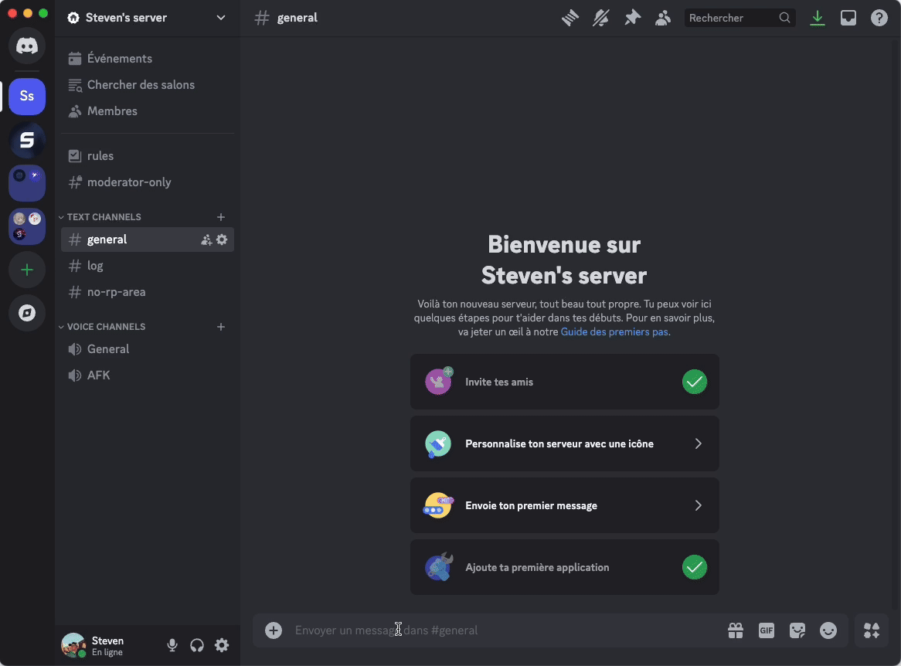

# Log Channel

The **"Log Channel"** option allows you to define which channel on your Discord server will receive logs. These logs display only the number of **RP gained or lost** by your members based on their activity.

### **How to Set a Log Channel?**

1. Access the `/settings` command and select **Logs Channel**.
2. In the dropdown menu, choose the channel on your server where the logs will be displayed.
3. Click **Save** to confirm your choice.

Once the channel is configured, the bot will automatically send information about RP gained or lost by your members in that channel.


You can choose the display style of the logs between Embed and Simple Message. [Learn how to customize the log style](type-de-logs.md).


<figure><figcaption></figcaption></figure>

#### **What happens if I don’t set a log channel?**

Without configuration, RP information will not be recorded in any channel. You will need to define a log channel to use this feature.

#### **Can the logs display anything other than RP gained or lost?**

No, the logs are specifically designed to track the RP progression of members.

#### **Can I change the log channel later?**

Of course! You can modify the log channel at any time using the `/settings` command.
