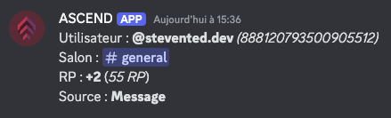
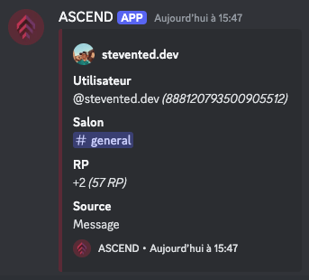

# Log Type

The **"Log Type"** option allows you to customize the display style of logs in the configured log channel. Choose between a **light** or **detailed** format depending on your preferences and your community’s needs.

### How to Change the Log Type?

1. Access the `/settings` command and select **Log Type**.
2. In the dropdown menu, choose your preferred display style:
   * **Light**: Logs are displayed as simple messages, perfect for a quick and distraction-free format.
   * **Detailed**: Logs use embeds, providing a structured and more visually detailed presentation.
3. Click **Save** to apply the changes.


Once you modify this setting, future logs will follow the selected display style.


<figure><figcaption></figcaption></figure>

### Available Display Styles

* **Light:**

<figure><figcaption></figcaption></figure>

* **Full** (Embed):

<figure><figcaption></figcaption></figure>

#### **Can I change the style at any time?**

Yes, you can switch between **Light** and **Detailed** at any time using the `/settings` command.

#### **Does the change affect previous logs?**

No, changing the style is not retroactive. Only new logs will be displayed in the selected format.
